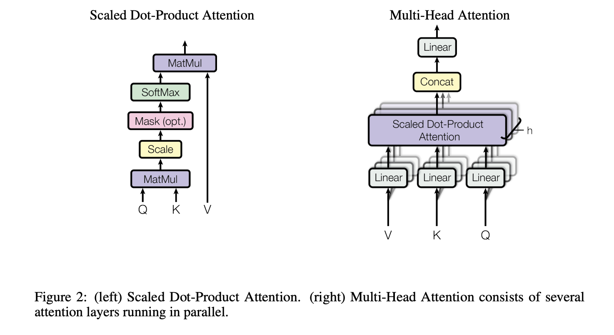
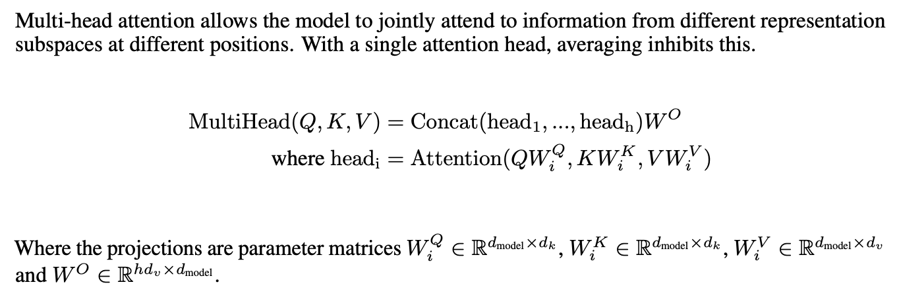
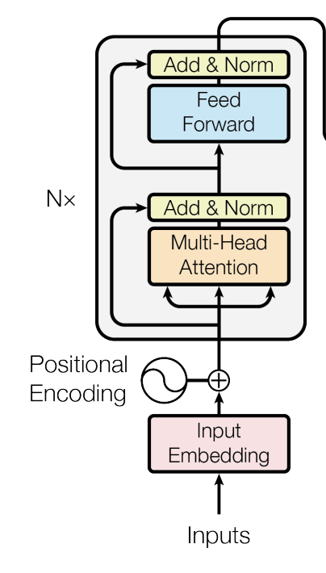

<!--more-->

## 📂 목차
- [한계](#한계)
- [구현](#구현)
    - [Scaled Dot Product Attention](#scaled-dot-product-attention)
    - [Multi-Head Attention](#multi-head-attention)
    - []()

---

## 📚 본문

논문: [Attention is All You Need](https://arxiv.org/pdf/1706.03762)

### 한계

기존의 순환(RNN) 및 합성곱(CNN) 신경망 등을 배제하고, 어텐션 메커니즘의 새로운 계산 방법 제안.

장점으로는:
- **병렬 처리 극대화 (Parallelization)**: RNN 은 시퀀스 데이터를 순차적으로 처리해야 했지만, 어텐션의 연산을 이용해 시퀀스 데이터를 병렬 처리가 가능하도록 함
- **장기 의존성 (Long-range Dependency)** 해결: 네트워크 내 임의의 두 입력/출력 위치 간의 거리를 상수 시간($O(1)$)의 순차적 연산만으로 연결하여 멀리 떨어진 단어 간의 문맥적 관계를 훨씬 쉽게 학습할 수 있도록 설계

### 구현



#### Scaled Dot Product Attention

부품을 먼저 만든다. Query, Key, Value 가 input 으로 들어가고, 최종적으로 Attention 에 따른 정도를 Value 에 적용시켜 결과로 Value 의 값을 보게 된다.

```python
import torch.nn as nn

class ScaledDotProductAttention(nn.Module):
    def __init__(self):
        super(ScaledDotProductAttention, self).__init__()

    def forward(self, query, key, value):
        pass
```

Scaled Dot Product Attention 은 query, key 를 MatMul 이후 scaling 을 수행하여 softmax 로 확률 값 매핑 후 value 와 곱한 값이 된다. 이때 matmul 이후 scaling 한 결과가 attention score 라고 불리며 attention score 를 softmax 에 거치게 되면 attention probability 라고 부른다. 마지막으로 나오는 결과는 head 별로 word 간의 상관관계를 나타내는 feature tensor 로 볼 수 있다.

행렬의 연산이 잘 정의되도록 transpose 를 취하자. shape 를 신경쓰며 연산을 수행한다.

```python
def forward(self, query, key, value):
    attn_score = (query @ key.transpose(-2, -1)) / self.qk_scale
```

scale 값을 나누는 이유는 q, k 내적은 각 성분의 평균이 0, 분산이 1 인데 내적했기 때문에 다 더해진다면 분산이 `d_k` 배 만큼 늘어나게 된다. 나중에 연산될 softmax 에 큰 값이 들어갈 경우가 생기므로, 이를 d_k ** 0.5 로 나누어 준다.

그 다음으로 Mask 를 해준다. 어텐션 메커니즘에서 마스크는 모델이 특정 토큰을 참조하지 못하도록 시야를 가리는 조작을 의미한다. 아주 작은 수를 넣어 소프트 맥스에서 해당 토큰에 대한 영향을 지울 수 있다.

```Python
def forward(self, query, key, value, mask = None):
    attn_score = (query @ key.transpose(-2, -1)) / self.qk_scale

    if mask is not None:
        attn_score.masked_fill_(mask == 0, -1e12)
```
Softmax 를 이제 거치자. 거치고 나온 값을 attention weight 혹은 attention probability 라고 한다. prob 을 value 와 matmul 하여 나온 결과를 value 와 MatMul 한다.

```python
def forward(self, query, key, value, mask = None):
    # ...

    return F.softmax(attn_score, dim = -1) @ value
```

#### Multi-Head Attention

멀티 헤드 어텐션은 Scaled Dot-Product Attention 을 이용해 구현한다. embedding dimension 이 쪼개어 들어가는 것을 명심한다.

```python
import torch.nn as nn

class MultiHeadAttention(nn.Module):
    def __init__(self, embedding_dim, d_k, d_v, heads = 8):
        super(MultiHeadAttention, self).__init__()

        assert embedding_dim == d_v * heads, "embedding_dim != d_v * heads"

    def forward(self, q, k, v, mask=None):
        pass
```

head 별로 쪼개어지고, value 와 MatMul 한 Scaled Dot Product Attention 이후에 이를 합쳐줄 때 heads와 곱한게 embedding_dim 과 동일해야 함을 검증하고, weight 가 필요한 모듈들을 선언한다.



q, k, v 는 각각 (임베딩 차원, d_k or d_v) 형태로 되어 있다. 따라서 이를 선언하고 짜주고 추후에 불필요한 변수를 삭제한다.

```python
class MultiHeadAttention(nn.Module):
    def __init__(self, embedding_dim, d_k, heads = 8):
        super(MultiHeadAttention, self).__init__()

        assert embedding_dim % heads == 0 and d_k % heads == 0

        self.heads = heads
        self.embedding_dim = embedding_dim

        # d_v
        self.head_dim = embedding_dim // heads
        self.d_k = d_k
        self.d_k_per_head = self.d_k // heads

        self.Wq = nn.Linear(embedding_dim, d_k)
        self.Wk = nn.Linear(embedding_dim, d_k)
        self.Wv = nn.Linear(embedding_dim, embedding_dim)

        self.scaled_dot_product_attention = ScaledDotProductAttention(self.d_k_per_head ** -0.5)
        self.Wo = nn.Linear(embedding_dim, embedding_dim)
```

연산을 이제 정의해주자. forward 부분에서는 Wk, Wq, Wv 를 각각 거친 결과를 reshape 를 해주어야 한다(헤드 별 병렬처리를 위함).

```Python
def forward(self, q, k, v, mask=None):
    # batch, length, d
    # -> batch. length, embedding_dim
    # -> batch, length, heads, head_dim
    # -> batch, heads, length, head_dim
    batch_size = q.shape[0]

    q = self.Wq(q).view(batch_size, -1, self.heads, self.d_k_per_head).transpose(1, 2)
    k = self.Wk(k).view(batch_size, -1, self.heads, self.d_k_per_head).transpose(1, 2)
    v = self.Wv(v).view(batch_size, -1, self.heads, self.head_dim).transpose(1, 2)

    attn = self.scaled_dot_product_attention(q, k, v, mask).transpose(1, 2).reshape(batch_size, -1, self.embedding_dim)

    return self.Wo(attn)
```

### Encoder

Multi-head Attention 을 이용해 Encoder 을 구현하자. 추가되는 것은 맨 뒤 Add & Norm 의 ResNet 아이디어와 MLP 레이어이다. 우선 FeedForward 를 만든다.

```python
class FeedForward(nn.Module):
    def __init__(self, d_model, d_hidden, d_out, dropout=0.1):
        super().__init__()
        self.fc1 = nn.Linear(d_model, d_hidden)
        self.fc2 = nn.Linear(d_hidden, d_out)
        self.dropout = nn.Dropout(dropout)

    def forward(self, x):
        return self.fc2(self.dropout(F.relu(self.fc1(x))))
```



인코더 레이어는 mha 와 ffn 레이어 그리고 잔차합 및 Layer Norm 구조이다.

```python
class EncoderLayer(nn.Module):
    def __init__(self, d_model, d_k, heads, d_ff, d_out):
        super(EncoderLayer, self).__init__()
        self.mha = MultiHeadAttention(
            embedding_dim=d_model,
            d_k=d_k,
            heads=heads
        )

        self.ffn = FeedForward(d_model, d_ff, d_out)

        self.norm1 = nn.LayerNorm(d_model)
        self.norm2 = nn.LayerNorm(d_model)

    def forward(self, x, mask=None):
        pass
```

preLN 이후에 이 결과를 집어넣는게 성능이 더 좋다고 한다. 따라서 이걸 우선하여 구현한다.

```python
def forward(self, x, mask=None):
    normed = self.norm1(x)
    attn_out = self.mha(normed, normed, normed, mask)
    x = x + attn_out

    normed = self.norm2(x)
    ffn_out = self.ffn(normed)
    x = x + ffn_out

    return x
```

이제 EncoderLayer 에 임베딩 벡터를 넣으면 된다.